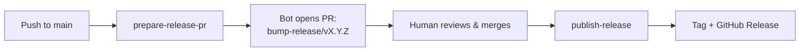

# Semantic Release Train

A PR-gated release automation pipeline built on
[`semantic-release`](https://semantic-release.org/): the version, the
changelog, and the GitHub Release all get computed from your commit
messages — but **nothing ever ships before a human reviews it, not even the
release commit itself.**

```
feat: add CSV export for the reports page          →  minor
fix: correct rounding error in the totals column    →  patch
feat!: redesign public API response envelope        →  major
```

## Why this exists

Kubernetes runs an entire subproject — [SIG-Release](https://github.com/kubernetes/sig-release)
— with its own tooling and dedicated leads, whose full-time job is making
releases predictable. Google built and open-sourced
[`release-please`](https://github.com/googleapis/release-please) internally
for this exact problem. `semantic-release` itself pulls upward of 2 million
downloads a week, and says its whole purpose, in the maintainers' own
words, is to "remove the immediate connection between human emotions and
version numbers."

If teams operating at that scale need dedicated tooling just to keep
version numbers and changelogs honest, "we'll just remember to bump the
version" was never going to hold up at any size. This is what that
tooling looks like when the non-negotiable constraint is: **nothing lands
on `main` without a reviewable PR — including the automation's own
commits.**

Full write-up, including the real bugs a live test run caught before this
shipped: **[Medium article — INSERT LINK]**

## How it works

Two jobs, both triggered on every push to `main`:

- **`prepare-release-pr`** computes the next version + release notes from
  commits since the last tag (via `semantic-release`'s dry-run mode — never
  tags or pushes anything itself), applies the version bump and changelog,
  and opens a PR from a fresh `bump-release/vX.Y.Z` branch. No-ops if
  nothing's releasable.
- **`publish-release`** runs again once that PR is merged. If
  `package.json`'s version has no matching git tag yet, it tags the commit
  and creates the GitHub Release. It never pushes anything new to `main` —
  it only tags a commit a human already reviewed.



Full design writeup, including *why* it's split this way and what breaks if
you don't: [`docs/architecture.md`](docs/architecture.md).

## Design decisions

- **PR-gated, no exceptions.** Every release commit — including the
  automation's own — goes through the same PR + CI + review path as any
  other change. Deliberate from the start, not conditional on any one
  platform setting.
- **Fresh branch per version, not one reused branch.** Each cycle creates a
  new `bump-release/vX.Y.Z` branch. Trade-off: two releasable commits
  landing close together can produce two competing PRs — the workflow
  auto-closes the older, now-stale one rather than solving for perfect
  single-flighting up front.
- **Dry-run isn't automatically side-effect-free — this was the big one.**
  Tagging is a core `semantic-release` step that fires regardless of which
  publish plugins are configured, on whatever branch is checked out. Full
  story: [`docs/bugs-found.md`](docs/bugs-found.md#bug-1-dry-run-isnt-automatically-side-effect-free).

## Bugs a live test run caught

None of these were visible from reading the workflow YAML — all four only
surfaced from running real commits through the pipeline in a live repo and
reading the Actions logs and Release pages:

1. **Dry-run isn't automatically side-effect-free** — a real
   `npx semantic-release` run tags `main` before any PR review even starts.
2. **Closed PRs were getting silently reused** instead of a fresh one
   opening — `gh pr view` matches by branch name regardless of state.
3. **`feat!:`/`fix!:` shorthand silently produced no release at all** — the
   default `angular` preset has no `!` handling, so the commit falls
   through unparsed with zero warning.
4. **Empty GitHub Release body for minor/major releases** — the
   release-notes extraction hard-coded a double-hash match, but
   semantic-release's writer heads major/minor releases with a single `#`.

Full details, root causes, rejected fix attempts, and how each was
verified: [`docs/bugs-found.md`](docs/bugs-found.md). Live evidence — the
actual commits, PRs, Actions runs, and published Releases — is public in
[`swikritb/release-train-test`](https://github.com/swikritb/release-train-test).

## Roadmap

Honestly listed, not hidden:

- A concurrency guard on `prepare-release-pr`, matching the one already on
  `publish-release`.
- `commitlint` as a required CI check, so a malformed commit type fails the
  PR at review time instead of silently producing zero release afterward.
- SHA-pinning third-party Actions, with a dependency bot to keep them
  current.
- Verifying branch protection is a platform-enforced rule, not just
  documented policy plus a client-side git hook.
- Environment-gated deploys tied to the release tag actually existing.
- A lightweight drift-detection check that fails CI if the manifest's
  version and the latest tag ever disagree.

## Getting started

See [`docs/setup.md`](docs/setup.md) for the full adoption steps —
required repo settings, dependencies, and known limitations.

## License

[MIT](LICENSE)
