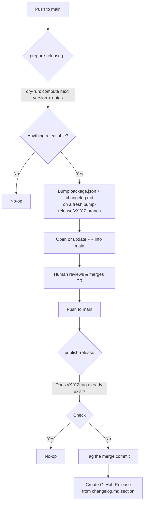

# Architecture

The whole design rests on one rule: **nothing ever pushes straight to `main`
— not even the release commit itself.** Every change, including the
automation's own version bump, goes through a normal, reviewable Pull
Request, same as any other change to the codebase.

That means the pipeline can't just run `semantic-release` and let it tag,
push, and publish in one shot — that's the default behavior, and it writes
straight to whatever branch is checked out. Instead, the work is split
across two independent jobs, both triggered on every push to `main`.

## The two jobs

### `prepare-release-pr`

Runs on every push to `main`. Computes the next version and release notes
from commits since the last tag, using `semantic-release`'s **dry-run** JS
API (`compute-release.mjs`) — not a real `npx semantic-release` run. That
distinction matters: a real run tags and pushes as a core step regardless of
which publish plugins are configured, which would land a premature tag on
`main` before any PR review (see [Bug #1](bugs-found.md#bug-1-dry-run-isnt-automatically-side-effect-free)).

If there's nothing releasable, it no-ops. Otherwise it:

1. Bumps `package.json`'s version.
2. Prepends the new release notes into `changelog.md` (rotating older
   entries into `changelog_archive.md` past a section-count cap), via
   `clean-changelogs.js`.
3. Commits both to a fresh `bump-release/vX.Y.Z` branch.
4. Closes any other still-open `bump-release/*` PR from a prior cycle —
   otherwise two releasable pushes close together leave a stale, outdated
   PR nobody cleans up (see [Bug #2](bugs-found.md#bug-2-closed-prs-were-getting-silently-reused)).
5. Opens (or updates, if one's already open for this exact version) a PR
   into `main`.

### `publish-release`

Also runs on every push to `main` — including the one that lands when a
release PR gets merged. It checks whether `package.json`'s current version
already has a matching git tag:

- If yes, it's a no-op — this push wasn't a release merge, or was already
  published by a concurrent run.
- If no, it tags the commit and creates the GitHub Release, pulling the
  release notes straight out of the matching section in `changelog.md`.

This job carries a `concurrency` group so two pushes landing close together
can't both pass the "does the tag exist" check before either one actually
pushes it.

## Why dry-run, not a real run

`semantic-release` treats tagging as a core step of its `prepare` phase —
it fires unconditionally after commit analysis, regardless of which publish
plugins (`@semantic-release/git`, `@semantic-release/github`, ...) are
configured, on whatever branch happens to be checked out. Since
`prepare-release-pr` runs directly on `main` (that's the branch a `push:
main` trigger checks out), a real run would tag `main`'s pre-bump commit
before the release PR even exists — silently defeating the entire
"nothing ships before review" premise. `compute-release.mjs` calls the same
analysis engine through its dry-run JS API instead, which is confirmed to
never tag or push anything; the workflow applies the version bump itself,
only inside the bot's own branch, after the dry run reports a version.

## Why the release-notes extraction needs its own logic

`publish-release` doesn't call `semantic-release` again — it just needs the
notes for the version that was already computed and merged, which live in
`changelog.md`. Extracting "just the newest section" turned out to be less
trivial than it looks: `semantic-release`'s changelog writer heads
**major/minor** releases with a single `#` and only **patch** releases with
`##`, and the extraction has to tell a real release heading apart from the
document's own `# Changelog` title (also single-hash) and from `###`-level
subheadings like `### Bug Fixes`. See
[Bug #4](bugs-found.md#bug-4-empty-github-release-body-for-minor-major-releases)
for the two-iteration fix and how it was verified.

See [`docs/commit-convention.md`](commit-convention.md) for what drives the
version-bump decision, and [`docs/bugs-found.md`](bugs-found.md) for the
full list of real bugs a live test run caught before this shipped.
